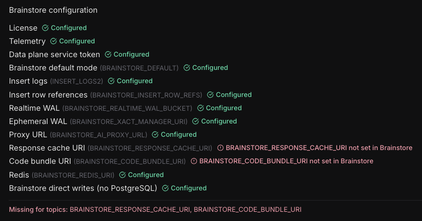

# Upgrade Guide

This document outlines breaking changes and required configuration updates for major releases.

## v6.0.0 - No-PG Brainstore Objects

This release introduces the ability to store Brainstore objects (such as project logs) directly in Brainstore, bypassing PostgreSQL entirely. This is an **opt-in** feature — upgrading to v6 makes no behavioral change unless you explicitly set `skipPgForBrainstoreObjects`.

> **⚠️ WARNING: This is a one-way operation.** Once an object type has been migrated off PostgreSQL, it cannot be un-migrated without downtime. Do not enable this unless you are ready to commit.

### Requirements to migrate

Before enabling no-pg mode, you must:

1. **Upgrade your data plane to version 1.1.32 or higher.**

2. **Verify all Brainstore configuration checks pass** on your organization's Data Plane settings page:

   

   The following checks are expected to be incomplete at this stage and can be ignored:
   - `Brainstore direct writes` — this will pass once the migration below is complete
   - `Response cache URI` and `Code Bundle URI` — these are part of a separate Topics configuration

### Enabling no-pg mode

Set the `skipPgForBrainstoreObjects` value in your `values.yaml`:

```yaml
# Skip PostgreSQL for all object types (recommended for new deployments)
skipPgForBrainstoreObjects: "all"

# OR: skip for specific objects only
skipPgForBrainstoreObjects: "include:project_logs:5ad850f0-3a1a-4980-b889-d21d4116b5d7,project_logs:45b3aed2-3dde-4f0d-a22c-9af69ee8508e"

# OR: skip for all objects except specific ones
skipPgForBrainstoreObjects: "exclude:project_logs:5ad850f0-3a1a-4980-b889-d21d4116b5d7"
```

When set, the following environment variables are automatically configured:

- **API**: `BRAINSTORE_WAL_USE_EFFICIENT_FORMAT=true`, `SKIP_PG_FOR_BRAINSTORE_OBJECTS=<value>`
- **Brainstore** (reader, writer, fastreader): `BRAINSTORE_ASYNC_SCORING_OBJECTS=<value>`, `BRAINSTORE_LOG_AUTOMATIONS_OBJECTS=<value>`

### No rollback

Unlike previous major version upgrades, there is **no rollback path** for this change. Once objects are migrated off PostgreSQL, reverting requires downtime and manual intervention. Reach out to the Braintrust team on Slack before enabling this if you have concerns.

---

## v2.0.0 - Brainstore Reader/Writer Split

This release introduces a significant architectural change that splits the Brainstore service into separate reader and writer services for improved scalability and performance.

### Breaking Changes

You will need to update your helm values.yaml overrides if you are upgrading from a 0.9.x/1.x Helm chart to our 2.x Helm chart. The structure of the `braintrust` section in values.yaml has changed so that there is now a `reader` and `writer` section.

#### Overview of Values.yaml Structure Changes

**Before (v1.x):**

```yaml
brainstore:
  enabled: true
  name: "brainstore"
  labels: {}
  annotations:
    serviceaccount: {}
    configmap: {}
    deployment: {}
    service: {}
    pod: {}
  replicas: 2
  image:
    repository: public.ecr.aws/braintrust/brainstore
    tag: v1.1.21
    pullPolicy: Always
  service:
    name: ""
    type: ClusterIP
    port: 4000
    portName: http
  serviceAccount:
    name: "brainstore"
    awsRoleArn: ""
    azureClientId: ""
    googleServiceAccount: ""
  resources:
    requests:
      cpu: "8"
      memory: "16Gi"
    limits:
      cpu: "16"
      memory: "32Gi"
  cacheDir: "/mnt/tmp/brainstore"
  objectStoreCacheMemoryLimit: "1Gi"
  objectStoreCacheFileSize: "50Gi"
  verbose: true
  extraEnvVars: []
```

**After (v2.0):**

```yaml
brainstore:
  # Shared configuration
  labels: {}
  serviceAccount:
    name: "brainstore"
    awsRoleArn: ""
    azureClientId: ""
    googleServiceAccount: ""
    annotations: {}  # MOVED: was brainstore.annotations.serviceaccount
  # Shared image configuration
  image:
    repository: public.ecr.aws/braintrust/brainstore
    tag: v1.1.21
    pullPolicy: IfNotPresent  # CHANGED: from Always

  # Brainstore Reader configuration
  reader:
    name: "brainstore-reader"
    labels: {}
    annotations:
      configmap: {}
      deployment: {}
      service: {}
      pod: {}
    replicas: 2  # CHANGED: can be scaled independently
    service:
      name: ""
      type: ClusterIP
      port: 4000
      portName: http
    resources:
      requests:
        cpu: "8"
        memory: "16Gi"
      limits:
        cpu: "16"
        memory: "32Gi"
    cacheDir: "/mnt/tmp/brainstore"
    objectStoreCacheMemoryLimit: "1Gi"
    objectStoreCacheFileSize: "50Gi"
    verbose: true
    extraEnvVars: []

  # Brainstore Writer configuration
  writer:
    name: "brainstore-writer"
    labels: {}
    annotations:
      configmap: {}
      deployment: {}
      service: {}
      pod: {}
    replicas: 1  # CHANGED: Only needs 1 minimum
    service:
      name: ""
      type: ClusterIP
      port: 4000
      portName: http
    resources:
      requests:
        cpu: "8"
        memory: "16Gi"
      limits:
        cpu: "16"
        memory: "32Gi"
    cacheDir: "/mnt/tmp/brainstore"
    objectStoreCacheMemoryLimit: "1Gi"
    objectStoreCacheFileSize: "50Gi"
    verbose: true
    extraEnvVars: []
```

### Required Migration Steps

#### Update your values.yaml overrides structure

1. **Move any serviceAccount annotations:**

   ```yaml
   # OLD
   brainstore:
     annotations:
       serviceaccount: {}

   # NEW
   brainstore:
     serviceAccount:
       annotations: {}
   ```

2. **Split brainstore configuration into reader/writer sections:**
   - Any configuration changes you made to the `brainstore` section will need to be moved and duplicated into both `brainstore.reader` and `brainstore.writer`
   - Fields include: `replicas`, `service` (e.g. `service.name` or `service.port`), `resources`, `objectStoreCache*`, or `extraEnvVars
   - Special note on `resources` if you modified them:
     - There should be at least two brainstore readers for HA purposes, but they can be half the CPU and Memory of the previous defaults.
     - There only needs to be one brainstore writer since it is a background worker and can tolerate rare short outages. 

#### Update replica counts and resources (optional)

You can now scale readers and writers independently:
- There should be at least two brainstore readers for HA purposes, but they can be half the CPU and Memory of the previous defaults.
- There only needs to be one brainstore writer since it is a background worker and can tolerate rare short outages.

```yaml
brainstore:
  reader:
    replicas: 2
    resources:
      requests:
        cpu: "4"    # Readers may need less CPU
        memory: "8Gi"
  writer:
    replicas: 1
    resources:
      requests:
        cpu: "8"
        memory: "16Gi"
```

#### Step 3: Deploy the upgrade

If you are unsure about any of the changes above, reach out to the Braintrust team on Slack and paste your before and after values.yaml so we can double-check for you.

```bash
helm upgrade braintrust ./braintrust -f your-values.yaml
```

### Rollback Instructions

If you need to rollback to v1.x:

1. **Restore old values.yaml structure**
2. **Rollback Helm release:**

   ```bash
   helm rollback braintrust <previous-revision>
   ```

### Validation

After upgrading, verify the deployment:

```bash
# Check pods are running
kubectl get pods -n braintrust | grep brainstore

# Verify services
kubectl get svc -n braintrust | grep brainstore
```

You should see:

- `brainstore-reader-*` pods running
- `brainstore-writer-*` pods running
- `brainstore-reader` and `brainstore-writer` services

### Support

If you encounter issues during the upgrade, please:

1. Check the validation steps above
2. Review your values.yaml against the new structure
3. Reach out over slack to Support
